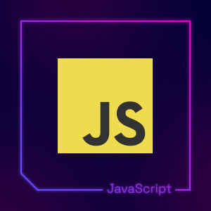

<h1 align="center">Hi I'm Shahsultan Islam Joy</h1>

<!-- Animated Header -->

  

<!-- Typing Animation -->

  

<!-- Profile Stats with Animation -->

  
  
  

<!-- Animated Divider -->

  

"Shahsultan Islam Joy" from Bangladesh  | Passionate about Design, Development, and Digital Creativity | Fluent in React, React Native, TypeScript, JavaScript, Prisma, Postgresql, Mongoose, MongoDB, Firebase, and Next.js, React Native | Dedicated to Crafting Intuitive Prisma Experiences 🚀"

  

- 👨‍💻Technology [car shop](https://car-shop-clientsite.vercel.app)

- 👨‍💻 web application [street food](https://car-shop-clientsite.vercel.app)
- 👨‍💻 Android app with React Native [Hunting-Business](https://hunting-business.uptodown.com/android)

- 👨‍💻 All of my projects are available at [https://md-shahsultan-islam-joy.vercel.app/](https://md-shahsultan-islam-joy.vercel.app/)
- 🌱 I’m currently learning **NeSt js,Electron js**
- 💬 Ask me about **react Native,javascript,tailwind**

<h3 align="left">Connect with me:</h3>

## Languages & Libraries I Use

| 🧠 Language       | 📦 Library / Tool     | 🏗️ Framework           |
|------------------|------------------------|-------------------------|
|  |  |  |
|  |  |  |
|  |  |  |
|  |  |  |

---

## 💻 Technologies & Tools I Use

| 🌐 Web Technologies        | 🎨 CSS Frameworks          | 🗄️ Databases & ORMs          | 🚀 DevOps & Cloud Tools         |
|----------------------------|----------------------------|-------------------------------|----------------------------------|
|  |  |  |  |
|  |  |  |  |
|  |  |  |  |
|  |                                |  |  |

<!-- --------------------langage and trolls------------- -->

<h3 align="center">Languages and Tools:</h3>

  
  
  
  
  
  
  
  
  
  

---------------
## View Readme status

  

<!-- ------------explore language -->

## :bulb: learn and explore Language_

       
       

  

   

<!---------------- Social---------------------- -->
<table width="100%" align="center">
<tr>
<td align="center">
<a href="https://shahsultan-islam-joy.vercel.app">
<strong>Visit my personal website </strong>
 
 
 

</a>

</td>

<td align="center">
<a href="https://www.linkedin.com/in/ss-joy">
<strong>Linkedin Profile</strong>
 
 

 
</a>

</td>
</tr>
</table>

<!-- --------footer -->
###

 

<!-- ------visitor count--------- -->
## :bulb: Visit my profile count_

