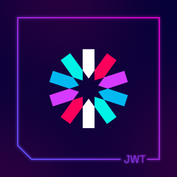

<h1 align="center">Hi I'm Shahsultan Islam Joy</h1>

"Shahsultan Islam Joy" from Bangladesh  | Passionate about Design, Development, and Digital Creativity | Fluent in React, MongoDB, Firebase, and Next js | Dedicated to Crafting Intuitive Material UI Experiences 🚀"

  

- 👨‍💻Technology [Phone store](https://github.com/Joy43/asingment--10-client.git)

- 👨‍💻 CSS workplace [social fontend](https://github.com/Joy43/Social-BD.git)

- 👨‍💻Management Project [world Hotel mangement](https://github.com/Joy43/assingment-11-hotel-client.git)

- 👨‍💻 All of my projects are available at [https://gregarious-taffy-4f027f.netlify.app/](https://gregarious-taffy-4f027f.netlify.app/)
- 🌱 I’m currently learning **Next js,Material ui**
- 💬 Ask me about **react,javascript,tailwind**

<h3 align="left">Connect with me:</h3>

## Skills

- **Languages:** JavaScript (ES6+), HTML5, CSS3
- **Frameworks/Libraries:** React,Next js
- **Content Management Systems:** WordPress,Shopify
- **Web Technologies:** APIs, JSON, JSON web token
- **CSS Frameworks:** tailwind,Daisyui,Flowbite

<!-- 

## Current status

 -->

<!-- -----------github status------------ -->
## 📊Github Stats

<!-- 

  <table>
    <tr>
      <td></td>
      <td>
      </td

</tr>
 

  </table>

  <table>
     
<td>

  
</td>
  </table>
  

  

 -->

<!-- -------------------------------------- -->

      

      

<!-- --------------------langage and trolls------------- -->

<h3 align="center">Languages and Tools:</h3>

  
  
  
  
  
  
  
  
  
  

---------------
## View Readme status

  

<!-- ------------explore language -->

## :bulb:learn and explore Language_

       
       

  

   

<!---------------- Social---------------------- -->
<table width="100%" align="center">
<tr>
<td align="center">
<a href="https://shahsultan-islam-joy.vercel.app">
<strong>Visit my personal website </strong>
 
 
 

</a>

</td>

<td align="center">
<a href="https://www.linkedin.com/in/shahsultan-islam-joy">
<strong>Linkedin Profile</strong>
 
 

 
</a>

</td>
</tr>
</table>

<!-- --------footer -->
###

 

<!-- ------visitor count--------- -->
## :bulb:Visit my profile count_

